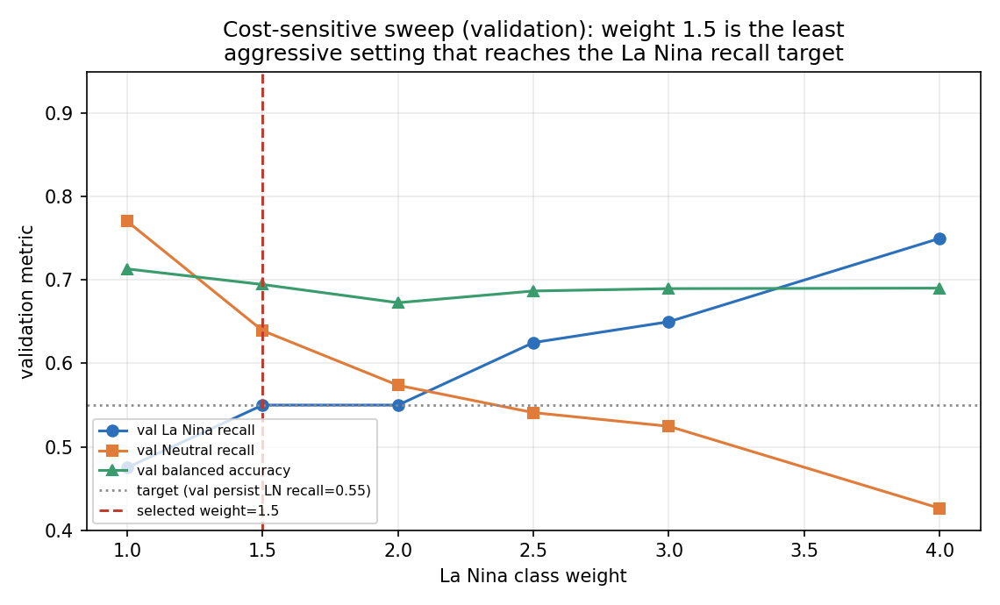
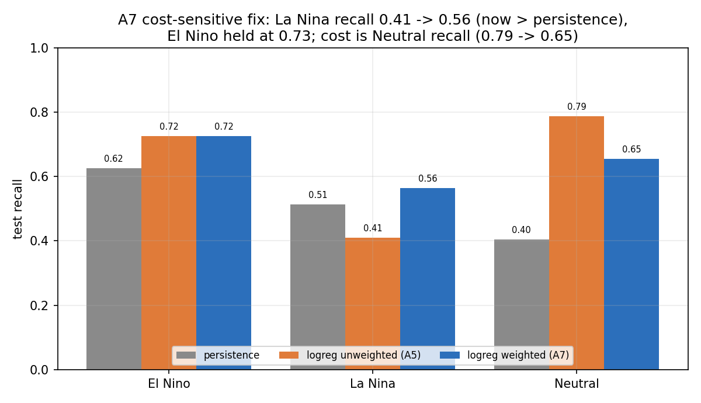
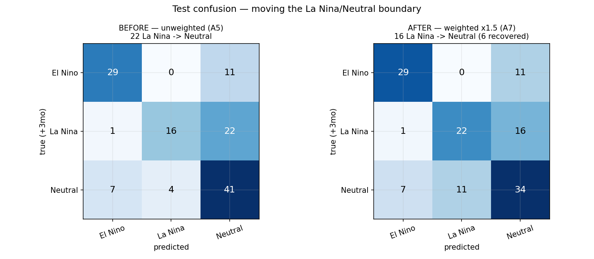
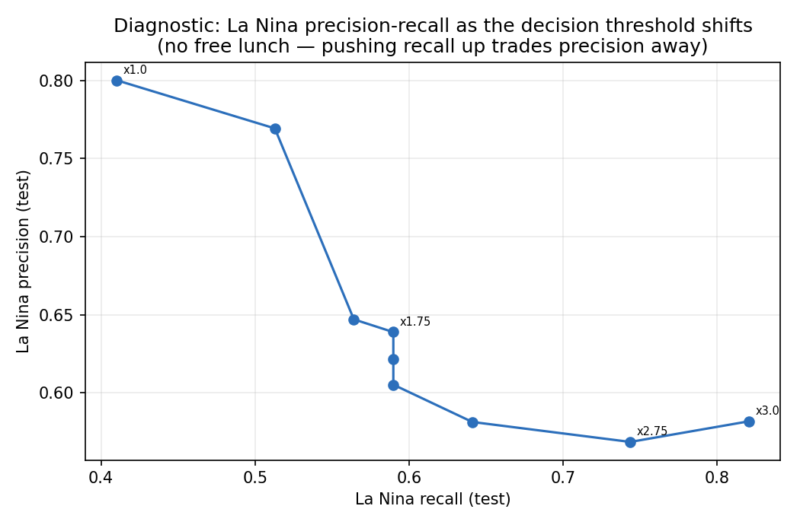
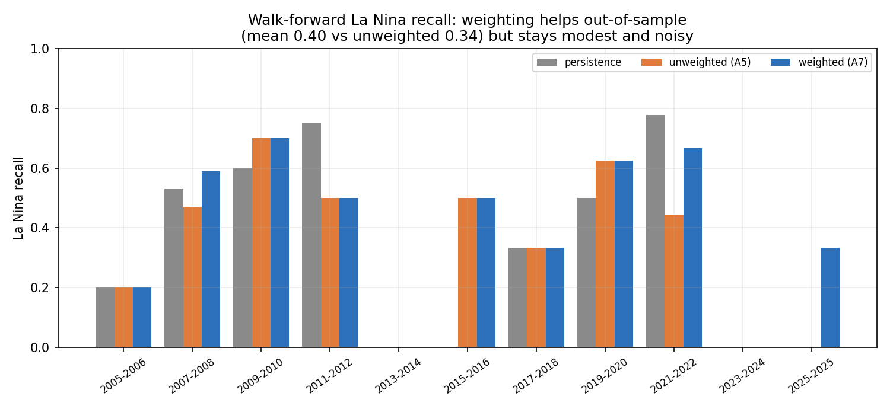

# Ryan Poppe

# Assignment 7 — Portfolio Modeling Progress and Preliminary Transfer-Learning Relevance

Two labeled parts. **Part A** is concrete modeling progress: I run the exact
experiment my Assignment 6 checkpoint named next. **Part B** is a preliminary,
evidence-based decision about whether Week 7's vision/transfer-learning methods
belong in this project.

**Portfolio work.** No change to the problem, target, split, metrics, or baselines
from Assignments 4–6; I reuse the locked table and chronological split verbatim so
every number is directly comparable to prior weeks. This is a staged checkpoint, not
a final model claim.

---

## Run evidence and reproducibility

**Dataset / task / target.** NOAA ENSO seasonal forecasting: at issue month `t`,
predict the 3-class ENSO state at `t+3` (El Niño / La Niña / Neutral) from NOAA
climate indices. Source: `data/enso_features_monthly.csv` (A4 locked snapshot).
Representation: the **A5 hand-built lag features** (12 numeric lag/roll/trend/season
columns + one-hot current state), the current-best portfolio representation from A6.

**Split / metrics.** Locked A4 chronological split (648 train / 120 val / 131 test),
unchanged. Metrics are the charter's: macro-F1 and balanced accuracy, with per-class
recall for the minority El Niño / La Niña events. Selection on validation; test
reserved for final reporting.

**Seed / determinism.** Seed `6320` on every estimator; lbfgs logistic regression is
deterministic. Re-running `train_a7.py` reproduces `run_summary.json` exactly.

**Commands.**

```bash
cd ut-cs6320-assignment-07
python3 train_a7.py     # cost-sensitive sweep + threshold diagnostic + walk-forward
python3 make_plots.py   # outputs/plots/*.png
```

**Artifacts** (`outputs/`): `model_comparison.csv`, `classweight_sweep.csv`,
`threshold_sweep.csv`, `per_class_before_after.csv`, `confusion_before.csv`,
`confusion_after.csv`, `walkforward_lanina.csv`, `run_summary.json`, `run_log.txt`,
and five plots in `outputs/plots/`.

---

# Part A — Portfolio modeling progress

## A1. Where the project stands

Client scenario (A4): a **seasonal climate-risk planner** who wants an early read on
whether the tropical Pacific will be El Niño, La Niña, or Neutral three months out.
Current model status coming into Week 7 (from A5/A6): the best candidate is the
**A5-lag multinomial logistic regression** (test macro-F1 0.649, beats persistence
0.516 in all walk-forward folds), and the Week-6 comparison confirmed that neither a
gradient-boosted tree nor an MLP beat it out of sample. The **one named weakness**,
found in A5 and reconfirmed in A6, is **La Niña recall**: the unweighted model catches
only 0.410 of La Niña events — *worse than persistence* (0.513) — by dumping 22 of 39
La Niñas into the Neutral bin. A6's checkpoint set the next experiment explicitly:
make the model cost-sensitive (or threshold-tuned) so La Niña recall reaches at least
persistence's level **without** giving back the El Niño/Neutral gains.

## A2. The experiment: cost-sensitive learning for the minority class

I kept everything fixed (representation, split, `C`=0.03, metrics) and changed exactly
one thing: the **class weights** in the logistic-regression loss. I swept a La Niña
weight over {1.0 … 4.0} (El Niño and Neutral fixed at 1.0) and, as a diagnostic
alternative, swept a **decision-threshold** boost on the La Niña posterior of the
unweighted model. Selection is on **validation only**, by one rule applied to both
sweeps: *among settings whose validation La Niña recall reaches the
validation-persistence recall (0.55), take the highest validation balanced accuracy,
breaking ties toward the least aggressive setting.*



The sweep behaves exactly as cost-sensitive theory predicts: heavier La Niña weight
monotonically raises La Niña recall (0.475 → 0.750 on validation) while Neutral recall
and balanced accuracy erode. The rule selects **La Niña weight = 1.5**, which among
the settings that reach the 0.55 target is both the highest-balanced-accuracy
(0.695) and the least-aggressive choice — so both halves of the rule agree.

## A3. Updated results, compared to the A5/A6 baseline

Final test results (`model_comparison.csv`), against the A5 unweighted model and
persistence:

| model | settings | La Niña recall | El Niño recall | Neutral recall | macro-F1 | bal-acc |
|---|---|---|---|---|---|---|
| persistence | domain rule | 0.513 | 0.625 | 0.404 | 0.516 | 0.514 |
| logreg unweighted (A5) | `class_weight=None` | 0.410 | 0.725 | 0.788 | 0.649 | 0.641 |
| **logreg weighted (A7)** | **La Niña ×1.5** | **0.564** | 0.725 | 0.654 | **0.655** | 0.648 |
| logreg balanced (ref) | `class_weight='balanced'` | 0.590 | 0.825 | 0.538 | 0.645 | 0.651 |
| logreg threshold (diag) | La Niña posterior ×2.75 | 0.744 | 0.725 | 0.442 | 0.627 | 0.637 |



The selected weighted model is a **near-Pareto improvement**, which is the result the
A6 criterion asked for:

- **La Niña recall 0.410 → 0.564** — now *above* persistence (0.513) and above the
  validation target, and its La Niña **F1 rises 0.542 → 0.611** (recall up, precision
  down only 0.80 → 0.67).
- **El Niño recall unchanged at 0.725** (F1 0.753) — the gain did not come out of the
  other minority class.
- **Overall macro-F1 nudged up 0.649 → 0.655** and balanced accuracy 0.641 → 0.648 —
  so the fix did not trade away the headline metric.
- **The cost is Neutral recall (0.788 → 0.654)** — expected and acceptable, since the
  planner cares more about correctly flagging active La Niña/El Niño states than about
  maximizing Neutral hits.

## A4. Evidence beyond the aggregate

**Confusion, before vs after** (`confusion_before.csv` / `confusion_after.csv`):



The mechanism is transparent: the La Niña row moves from `[1, 16, 22]` to
`[1, 22, 16]` — six La Niñas recovered from the Neutral bin — while the Neutral row
moves from `[7, 4, 41]` to `[7, 11, 34]`, i.e. seven Neutrals now fall to La Niña. The
intervention is precisely a **shift of the La Niña/Neutral decision boundary**, not a
new source of signal.

**Threshold diagnostic** (`threshold_sweep.csv`) confirms the same boundary from the
other direction and shows there is **no free lunch**:



Boosting the La Niña posterior can drive test recall to 0.744 (τ=2.75), but precision
falls and macro-F1 drops to 0.627 — more aggressive than reweighting and worse overall.
This bounds how far the La Niña fix can go on the current representation.

**Walk-forward robustness** (`walkforward_lanina.csv`), the small-sample check I have
used since A5:



Across 11 expanding-window folds the weighted model's mean La Niña recall is **0.404
vs 0.343 unweighted** (persistence 0.336), while mean macro-F1 is essentially
unchanged (0.522 vs 0.527). So the fix **generalizes out of sample** — it helps or
ties La Niña recall in most folds (notably 2007–08, 2021–22, 2025) — but the gain is
modest and noisy, and several folds contain zero La Niña events.

## A5. Blocker / failure mode

The honest limiter is unchanged from the A4 audit and now quantified: **the
improvement is real but small and unstable because there are so few independent La
Niña episodes.** Walk-forward La Niña recall still swings fold to fold (0.00 in folds
with no or few La Niña months, up to 0.70), the confidence intervals are wide, and the
threshold diagnostic shows the La Niña/Neutral classes genuinely overlap at +3 months
on the index features — reweighting relocates the boundary but cannot manufacture
separation the features do not contain. In short, I have fixed the *decision rule*;
the residual ceiling is a **feature/representation limit**, not a loss-weighting one.

## A6. Implication for the next staged experiment

Because the remaining gap looks feature-limited, the next experiment should test
**whether a more independent feature separates La Niña from Neutral**: add **MEI.v2**
(which blends sea-level pressure and winds, not just SST, and per the A4 audit tracks
the same ENSO signal while being constructed differently), handling its pre-1979 gap,
and re-run the same cost-sensitive model. If MEI does not close the La Niña/Neutral
overlap, that is the evidence that the ceiling is intrinsic to +3-month index
forecasting — which is exactly the question a modality-native **sequence model
(Week 9)** would then be positioned to test.

---

# Part B — Preliminary transfer-learning relevance decision

## B1. Decision: vision transfer learning is *not relevant*; the idea is only *indirectly* relevant via a modality I have deliberately declined

**Not directly relevant.** My portfolio data is a handful of numeric NOAA climate
indices summarized into ~14 tabular features. There are no images, and my
representation has no pixel grid, spatial locality, or channel structure for a
convolution to exploit. Pretrained vision models (ImageNet CNNs, etc.) learned edge/
texture/object features that are meaningless for a Niño-3.4 lag vector, so a frozen
CNN feature extractor, a compact CNN, or fine-tuning a pretrained vision backbone
would add cost and opacity with no plausible signal. Per the assignment's own
guidance, I am *not* forcing an image model onto a non-image project.

**Where the broader idea *could* enter — and why I decline it now.** The one honest
caveat is that ENSO *does* have an underlying image-like representation: the gridded
sea-surface-temperature (SST) field. A CNN/ConvLSTM over gridded SST maps is a real
research direction, and pretrained-feature-extraction ideas transfer more naturally
there than to my index table. But my **A4 charter already considered and explicitly
declined** a gridded-SST CNN as the main deliverable (optional stretch only), for
reasons Weeks 5–7 have since *confirmed with evidence*: the binding constraint on this
problem is the small number of independent ENSO events, not model capacity, so a
high-capacity vision model would overfit exactly as the degree-2 (A5) and MLP (A6)
experiments did. So the correct status is **indirectly relevant, deferred**: vision-
style methods matter only if I switch to the gridded-SST modality, which I am not
doing without instructor approval.

**What *is* better aligned.** The current representation is tabular/sequential, and
the evidence says a **simple, interpretable classical model on lag features** is the
right family: it beats persistence, it beat the tree and MLP out of sample (A6), and
this week a one-line cost-sensitive change fixed its main weakness. The natural next
capacity step, if any, is a **sequence model (Week 9)** that keeps the data sequential
end-to-end — not a vision model.

## B2. Evidence I already have

- **A6 model comparison:** neural and tree models did not beat logistic regression on
  test (0.544 / 0.504 vs 0.566 on the proxy); added capacity has repeatedly failed to
  help on this sample. A pretrained/deep vision model is even more capacity for even
  less modality fit.
- **A5 capacity probe + A7 walk-forward:** the ceiling is set by the small independent-
  event count and the La Niña/Neutral feature overlap, not by model class.
- **Data type:** the inputs are low-dimensional numeric indices with no spatial/pixel
  structure — the precondition for CNNs is simply absent.

## B3. Evidence still missing before this becomes final (Assignment 8)

- Whether a more independent **feature (MEI.v2)** closes the La Niña/Neutral gap on the
  index representation (A6 next experiment).
- Whether a **sequence model** on the raw monthly series beats the tabularized lag
  model (Week 9) — the real "does more modality-appropriate capacity help?" test.
- I have *not* built any gridded-SST representation, so I cannot yet quantify what a
  spatial CNN would add; the non-adoption is currently an argument from data type and
  sample size, not a head-to-head result. Assignment 8 (fine-tuning across domains)
  is the point to revisit this.

## B4. Effect on the A4 audit / charter

No scope change. This **reaffirms** two charter positions with fresh evidence: (a) the
deliberate choice *not* to build a gridded-SST CNN as the main deliverable is now
supported by three weeks of "capacity does not help on this sample" evidence, not just
an up-front time argument; and (b) the small-independent-event limitation remains the
dominant risk and should stay flagged as **still-untested against non-stationarity**.
The A7 result also promotes the **La Niña minority-recall issue** from "open weakness"
to "addressed at the decision-rule level, feature-limited beyond that."

## B5. New risks a pretrained / modality-specific model would introduce

If I later adopt vision/transfer methods (gridded SST), the audit would need new risk
entries that do not exist for my current index model: **pretraining–domain mismatch**
(ImageNet vs geophysical fields), **spurious visual cues / shortcut learning** (a CNN
keying on map artifacts or land masks rather than SST structure), **domain shift and
non-stationarity** amplified by a high-capacity model, **memorization** of the few
strong events, **licensing/provenance** of pretrained weights (versus my clean public-
domain NOAA data), and materially higher **compute, maintainability, and overclaiming**
risk. None of these burden the current logistic-regression model, which is one more
reason the simpler family stays aligned with the stakeholder's need for a cheap,
inspectable, honest baseline — not an operational forecast.

## Sources

- A4 charter + dataset audit, A5 evaluation report, A6 model-choice checkpoint:
  `../../ut-cs6320-assignment-04/writeups/`, `../../ut-cs6320-assignment-05/writeups/`,
  `../../ut-cs6320-assignment-06/writeups/`.
- Evidence: `outputs/` (`model_comparison.csv`, `walkforward_lanina.csv`,
  `run_summary.json`, `run_log.txt`, `plots/`).
